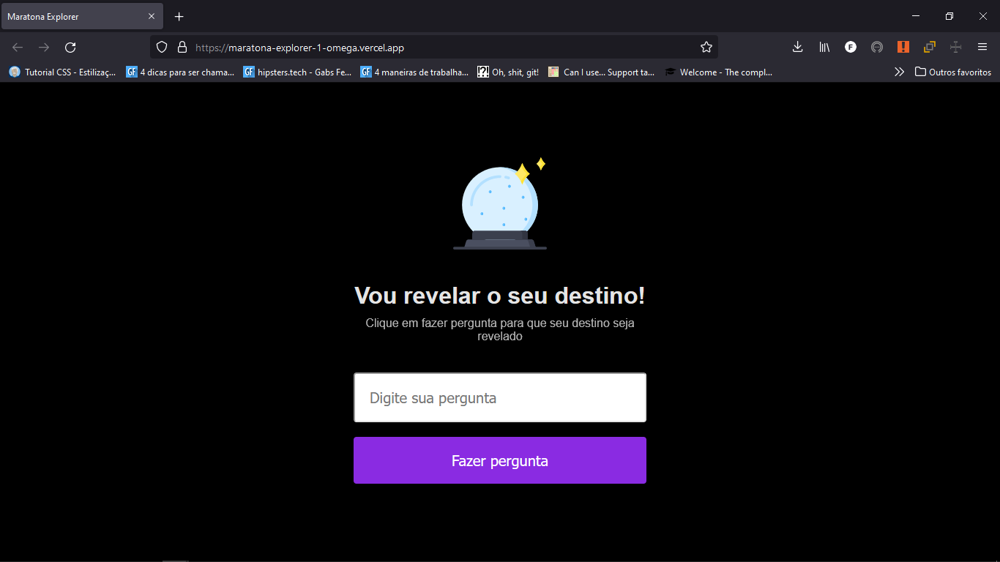

# Dia 1 - https://evento.rocketseat.com.br/maratona-explorer/episodios/explorer/aula-1/edicao/1

## Notion: https://efficient-sloth-d85.notion.site/Maratona-Explorer-a90d9b149e2e40c8863d0732007fa05d

Os três pilares fundamentais para aprender programação:

Foco = Vamos direto ao ponto para alcançar os seus objetivos mais rápido. Tenha foco naquilo que quer aprender (Front-End) e dá o seu melhor.

- Não precisa memorizar os códigos, precisa entender. Nunca memorize nada. Você precisa entender o que as tags fazem. E no começo você não vai memorizar tudo de primeira. E se não consegue lembrar? Google!

Prática = Acumular experiências e aplicar nos seus projetos. Sua carreira vai acelerar muito com isso.

Grupo = Esteja junto com outros profissionais da sua área. Ajude e peça ajuda, compartilhe o aprendizado, troca de experiências.

## Guia de aproveitamento excelente:

### Como estudar programação com eficiência

- Aprendizado ativo vs. passivo
- Metodologia PARE
- Perguntar - Anotar - Revisar - Explicar

### Técnica para acompanhar os vídeos

Técnica REC: 
1. Entenda
2. Code
3. Revise

## Não estou entendendo tudo, o  que faço?

Não tem problema não entender tudo de primeira!!!

*Leva tempo e mais conhecimento para que as coisas façam mais sentido*

## Ajuste de mentalidade

- Fator TEMPO. O cérebro precisa de tempo para assimilar as coisas
- Você precisa ter persistência
- Programar é encontrar soluções!
- "Eu sinto que estou só copiando e colando"
- Você gosta do que está fazendo?(Pergunte isso para si mesmo todos os dias)

## O que é programação?

É ensinar o computador com algoritmos(Passo a passo, conjunto de regras), lógica de programação(maneira de pensar) e sintaxe(maneira correta de escrever).

Linguagem de programação: JavaScript

Como é feita uma comunicação Front-End com Back-End? - Pesquisar HTTP e URL

# HTML = HyperText Markup Language

- Hyper Texto?
- Marcação
  - tags
  - atributos
- Linguagem
  - Maneira de escrever

O que é hypertext?
O que é markup?
O que é tag?
O que é linguagem HTML?

## Desafio: Apague algum pedaço de código e reescreva da sua cabeça.

# Dia 2 - Revisão aula 01 ao vivo = https://evento.rocketseat.com.br/maratona-explorer/episodios/explorer/aula-2/edicao/1

Nós vamos juntos construir uma carreira promissora pra você no mundo da programação. No final dessa semana, você vai ver como iniciar no mercado da programação do jeito certo. Além disso, também vai ver como se tornar a primeira opção dos tech recruiters e construir um portfólio de destaque. Pra isso, vamos construir uma aplicação completa na Maratona Explorer.

"Qual é o momento de largar o curso e começar a fazer um projeto sozinho?"
Maik Brito: Hoje e agora!
Nada impede de fazer um projeto e você não está colocando em risco a vida de ninguém. Quando você faz um projeto você vai falar: "Ih isso aqui pensei que sabia, mas não sei." Ótimo! O que isso te ajudou? A ter a consciência de que você precisa estudar mais, você precisa saber mais, se esforçar mais. O choque de não saber é ótimo. Ele que te movimenta a estudar mais e você vai querer estudar mais. Aprendeu algo ontem? Coloca em prática hoje! Precisa? Não precisa. Mas se você quer fazer sozinho? Faça hoje e agora!

Ansieade: Calma! Isso pega todo mundo! Eu(maik brito), pega você. Maik: Eu preciso me controlar demais. A gente precisa ter o controle de ansieade. Na nossa área, existe muitas maneiras de fazer qualquer coisa. Aquele CSS que a gente fez na maratona, tem várias maneiras de fazer ele. (Felipe: Lembro que já ia meter um display: flex, pensei alto e fiquei desesperado. A dica é o seguinte: CALMA.)
A gente quer trazer tudo para agora, preciso trazer tudo isso para agora. Você vai ter excesso de informação, uma overdose de informação e você vai dar pane. Não precisa disso. Você precisa entender o que você precisa entender hoje. Amanhã você vai entender um pouco mais e depois de amanhã um pouco mais, e assim vai. Você vai ficar ansioso todos os dias quando estiver codando.

*Sempre existe o próximo passo. Você precisa saber só disso.* Não precisa saber de todos os passos. E se você souber aí você não vai fazer nada. Matou sua ansiedade e não vai fazer nada. Você é persistente, parabéns!
Ainda que você está ansioso e com medo de não conseguir ser um programador.

Cuide do seu código, estude clean code. Mas não queira aprender tudo de uma vez. Cuidado com a ansiedade.

***Não se desespere com dinheiro. Mas sim foca no seu futuro. Aonde você quer estudar em 2 anos? Em 4 anos? Foca no presente também e nos seus estudos. Porque é do presente para o futuro. Dinheiro é a consequência dos seus estudos. Não estude programação focando no dinheiro, em ficar rico. Não! Tem que gostar de programação, gostar de aprender programação, gostar pelo menos do que está fazendo. Se não gostar então desista agora! Essa área não é para você. Mas se você gosta do que está vendo e fazendo aí sim teremos um programador de sucesso. Estude bastante e sempre. Seu futuro agradece por você ter estudado.***

# Dia 3 - Preparação para uma carreira sólida = https://evento.rocketseat.com.br/maratona-explorer/episodios/explorer/aula-3/edicao/1

## Introdução ao CSS

**É recomendado ter constância e qualidade de aprendizado! isso faz muita/toda diferença**

*O objetivo é usar programação para deixar a vida melhor*

